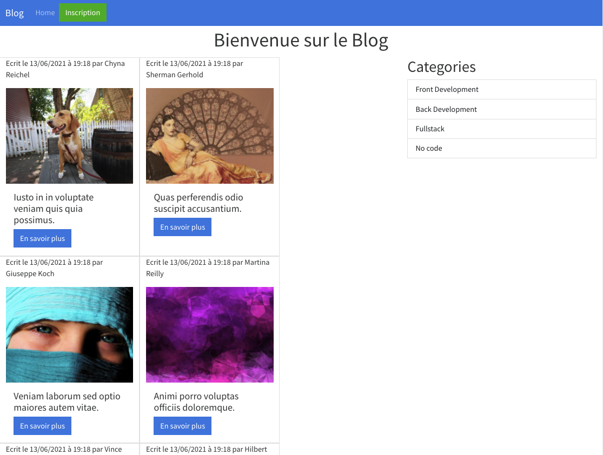

#  :musical_score: Blog Demo Symfony

## Create a blog with Symfony5

## Illustration


## Language/tools
- HTML5 / CSS3 
- Bootstrap
- PHP / Symfony5

## Goals 
- Discover Symfony5
- Practice PHP

## How to use 

### Launch MAMP server

### Launch the development server & meeting on http://localhost:8000/
``` php
symfony server:start
```

## Status
Project not completed

## Context
Project developed as a junior web developer

